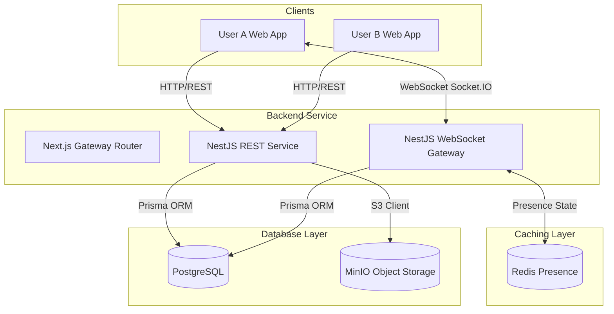
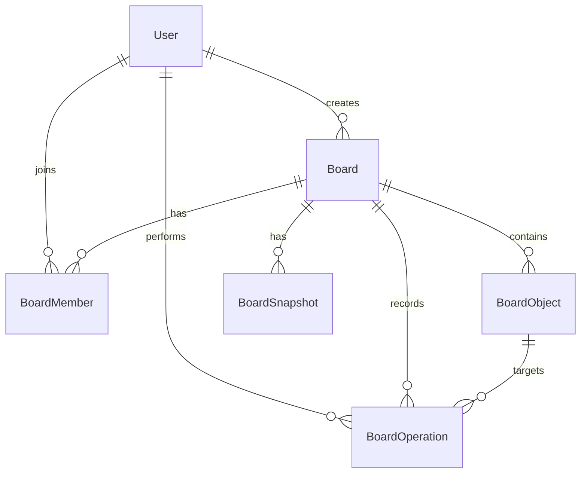

# Realtime Collaborative Tactical Whiteboard

Dự án **Realtime Collaborative Tactical Whiteboard** được phát triển cho chương trình **Viettel Digital Talent 2026 - Software Engineer Track**. Đây là một hệ thống monorepo cung cấp một bảng vẽ (whiteboard) cộng tác trực tuyến trên nền tảng Web, cho phép nhiều người dùng tham gia vào cùng một phòng và tương tác với các đối tượng trên canvas ảo trong thời gian thực, có khả năng nhận diện sự hiện diện của người dùng khác (presence awareness), đồng bộ tránh xung đột chỉnh sửa và lưu trữ dữ liệu tập trung phía máy chủ.

---

## 1. Tổng quan dự án & Mục tiêu sản phẩm

### 1.1 Giá trị cốt lõi (Core Values)

1. **Cộng tác thời gian thực (Realtime Multi-User Editing)**: Các thay đổi về hình vẽ, văn bản do một người thực hiện lập tức hiển thị trên màn hình của tất cả các thành viên khác trong phòng.
2. **Nhận diện sự hiện diện & Con trỏ (Presence & Cursor Awareness)**: Hiển thị danh sách các thành viên đang hoạt động trực tuyến và di chuyển vị trí con trỏ chuột của họ trực quan trên canvas.
3. **Lưu trữ & Khôi phục khi mất kết nối (Persistence & Reconnect Recovery)**: Dữ liệu canvas được lưu trữ liên tục ở Database phía máy chủ, cho phép khôi phục toàn bộ trạng thái khi tải lại trang hoặc tự động đồng bộ lại sau khi kết nối mạng bị gián đoạn.
4. **Giải quyết xung đột thông minh (Conflict-Aware Collaboration)**: Sử dụng phiên bản (object-level versions) để phát hiện chỉnh sửa lỗi thời và cơ chế số thứ tự sửa đổi (revision ordering) ở cấp độ phòng để quản lý thứ tự các thao tác ghi nhận vào cơ sở dữ liệu.

### 1.2 Phạm vi sản phẩm (MVP vs. Non-Goals)

- **Tính năng cốt lõi (MVP)**:
  - Tạo phòng vẽ công khai (Public Room) và chia sẻ liên kết tham gia.
  - Phân quyền người dùng trong phòng (`OWNER` - Chủ sở hữu, `EDITOR` - Biên tập viên, `VIEWER` - Người xem).
  - Tương tác canvas cơ bản: kéo (pan), thu phóng (zoom).
  - Vẽ các hình học cơ bản: hình chữ nhật (Rectangle), hình tròn (Circle), đường mũi tên (Arrow Line) và hộp văn bản (Text).
  - Chỉnh sửa, di chuyển, thay đổi kích thước, xoay và xóa các hình vẽ.
  - Đồng bộ hóa thời gian thực, hiển thị con trỏ của người dùng khác, và lưu trữ dữ liệu vào database.
- **Tính năng mở rộng (Should-Have)**:
  - Đăng nhập qua Google OAuth (JWT).
  - Phòng riêng tư (Private Room) và giao diện quản lý vai trò thành viên (Role Management UI).
  - Xóa phòng vẽ (chỉ cho phép Chủ sở hữu).
  - Hiển thị chỉ báo khóa đối tượng khi có người khác đang chỉnh sửa đối tượng đó (Object-locking indicator).
- **Không thực hiện (Non-Goals)**:
  - Canvas vô hạn không giới hạn biên độ vẽ phức tạp, tích hợp bản đồ thực địa, hay thiết kế tối ưu hóa trước cho thiết bị di động (Mobile-first).
  - Vẽ tự do (Freehand drawing).
  - Hệ thống quản lý layer chi tiết, nhóm đối tượng (grouping), hoặc chọn cùng lúc nhiều đối tượng (multi-select).
  - Tích hợp cuộc gọi thoại/video hay chat box trực tiếp.
  - Tải lên hình ảnh hoặc tệp đa phương tiện cá nhân.

---

## 2. Kiến trúc Monorepo & Công nghệ sử dụng

Dự án được tổ chức dưới dạng Monorepo sử dụng **Turborepo** và trình quản lý gói **pnpm** nhằm tối ưu hóa hiệu năng build và chia sẻ code:

### 2.1 Cấu trúc thư mục ứng dụng

- **[apps/web](file:///d:/workspace/Realtime%20Collaborative%20Tactical%20Whiteboard/apps/web)**: Ứng dụng phía máy khách (Client app) xây dựng với **Next.js 16 (App Router)**, **React 19**, **React-Konva** (thư viện vẽ Canvas), **Zustand** (quản lý trạng thái), **Tailwind CSS** (giao diện) và **Socket.IO Client** để kết nối thời gian thực.
- **[apps/api](file:///d:/workspace/Realtime%20Collaborative%20Tactical%20Whiteboard/apps/api)**: Ứng dụng phía máy chủ (Backend app) sử dụng framework **NestJS 11** để cung cấp các dịch vụ RESTful API, WebSocket Gateway (Socket.IO) và kết nối DB thông qua **Prisma ORM**.
- **[packages/database](file:///d:/workspace/Realtime%20Collaborative%20Tactical%20Whiteboard/packages/database)**: Định nghĩa lược đồ cơ sở dữ liệu **PostgreSQL**, quản lý các tệp migration và sinh mã nguồn Prisma Client dùng chung.
- **[packages/shared-contracts](file:///d:/workspace/Realtime%20Collaborative%20Tactical%20Whiteboard/packages/shared-contracts)**: Nơi khai báo các kiểu dữ liệu chung (TypeScript interfaces) và schema xác thực dữ liệu **Zod** dùng chung cho cả Frontend và Backend, đảm bảo tính nhất quán của dữ liệu truyền nhận.

### 2.2 Sơ đồ kiến trúc hệ thống



---

## 3. Thiết kế Cơ sở dữ liệu

Dự án sử dụng cơ sở dữ liệu **PostgreSQL** kết hợp với **Prisma ORM**. Mô hình được thiết kế phân tách giữa **Trạng thái hiện tại** của các hình vẽ (`BoardObject`) và **Nhật ký thay đổi** lịch sử (`BoardOperation`) nhằm phục vụ cho cơ chế đồng bộ, khôi phục trạng thái và giải quyết xung đột khi cộng tác.

### 3.1 Sơ đồ quan hệ thực thể (ERD)



### 3.2 Mô tả các Model chính trong Schema

- **`User`**: Quản lý định danh người dùng, thông tin cá nhân và xác thực tài khoản.
- **`Board`**: Đại diện cho phòng vẽ, lưu trữ siêu dữ liệu (metadata), revision hiện tại của phòng vẽ, trạng thái xóa.
- **`BoardMember`**: Quản lý thành viên tham gia phòng vẽ với các vai trò (`OWNER`, `EDITOR`, `VIEWER`).
- **`BoardObject`**: Lưu trữ trạng thái hiện hữu của từng hình vẽ trên canvas (loại hình vẽ: `RECTANGLE`, `CIRCLE`, `LINE`, `TEXT`), tọa độ (`x`, `y`), thuộc tính style (kích thước, màu sắc, nét vẽ...), thứ tự hiển thị (`zIndex`) và `version` hiện tại của đối tượng đó.
- **`BoardOperation`**: Nhật ký ghi nhận tuần tự từng sự kiện thay đổi (`OBJECT_CREATE`, `OBJECT_UPDATE`, `OBJECT_DELETE`, `OBJECT_RESTORE`) liên kết trực tiếp tới số revision của phòng vẽ.
- **`BoardSnapshot`**: Điểm lưu trữ nhanh trạng thái của toàn bộ Board tại một revision nhất định, giúp tối ưu hóa thời gian đồng bộ cho các thiết bị tham gia sau.

---

## 4. Cơ chế Đồng bộ hóa & Giải quyết xung đột

### 4.1 Luồng đồng bộ hóa tập trung (Server-Authoritative Sync)

Ứng dụng áp dụng luồng hoạt động ưu tiên máy chủ xác thực:

1. **Gửi yêu cầu thao tác**: Client thực hiện vẽ/chỉnh sửa trên canvas cục bộ (optimistic update ở phía UI để đảm bảo độ mượt mà) rồi phát đi một sự kiện Socket kèm theo các thay đổi và phiên bản hiện tại của hình vẽ (`baseObjectVersion`).
2. **Xác thực & Commit tại Server**: Server nhận được sự kiện sẽ kiểm tra quyền hạn của người dùng, đối chiếu `baseObjectVersion` với phiên bản hiện tại trong Database. Nếu hợp lệ, Server thực hiện lưu Database (cập nhật trạng thái hình vẽ và thêm vào nhật ký operation log), tăng giá trị `currentRevision` của phòng vẽ và gán revision này cho operation.
3. **Phát sóng (Broadcast)**: Server phản hồi lại cho Client gửi yêu cầu và phát sự kiện `operation:applied` đến tất cả các Client khác trong phòng để cập nhật canvas của họ.

### 4.2 Giải quyết xung đột dữ liệu (Optimistic Concurrency Control)

- **Kiểm tra phiên bản**: Khi người dùng muốn chỉnh sửa đối tượng, Server đối chiếu:
  `client.baseObjectVersion === server.currentObjectVersion`.
- **Nếu khớp (Thành công)**: Áp dụng thay đổi, nâng số version của đối tượng lên `version + 1` và cập nhật phòng vẽ.
- **Nếu không khớp (Xung đột)**: Thao tác bị bác bỏ. Server gửi thông báo lỗi (ví dụ: `operation:rejected`), Client thực hiện hoàn tác (rollback) trạng thái chỉnh sửa tạm thời và kéo trạng thái mới nhất của đối tượng từ máy chủ về.

### 4.3 Đồng bộ lại sau khi mất kết nối

Khi một Client kết nối lại sau khi bị mất mạng, nó gửi yêu cầu `sync:request` kèm theo số revision cuối cùng mà nó ghi nhận trước khi ngắt kết nối:

- Nếu khoảng cách revision nhỏ, Server chỉ gửi các bản ghi `BoardOperation` phát sinh trong giai đoạn mất kết nối để Client tự bù đắp trạng thái.
- Nếu khoảng cách quá lớn hoặc không xác định được revision, Server sẽ gửi toàn bộ trạng thái các đối tượng hiện tại (`BoardObject[]`) để Client dựng lại canvas mới nhất.

---

## 5. Hướng dẫn cài đặt & Chạy chương trình

### 5.1 Yêu cầu hệ thống (Prerequisites)

Để cài đặt và vận hành hệ thống, máy tính của bạn cần trang bị sẵn các công cụ sau:

- **Node.js** phiên bản 20 trở lên.
- **pnpm** phiên bản 10 trở lên (`npm install -g pnpm`).
- **Docker** & **Docker Compose** (để chạy các container dịch vụ đi kèm hoặc chạy toàn bộ ứng dụng).

### 5.2 Cấu hình Biến môi trường

Sao chép tệp cấu hình mẫu và điều chỉnh các giá trị phù hợp trong tệp [`.env`](file:///d:/workspace/Realtime%20Collaborative%20Tactical%20Whiteboard/.env) ở thư mục gốc:

```bash
# Tạo file cấu hình từ file mẫu nếu có (hoặc tạo mới)
cp .env.example .env
```

Các biến môi trường quan trọng cần cấu hình:

- `PORT` & `NGINX_PORT`: Cổng dịch vụ Backend và Proxy Nginx.
- `POSTGRES_DB`, `POSTGRES_USER`, `POSTGRES_PASSWORD`: Thông tin kết nối CSDL PostgreSQL.
- `GOOGLE_CLIENT_ID`: Định danh ứng dụng xác thực Google OAuth.
- `MINIO_ACCESS_KEY`, `MINIO_SECRET_KEY`: Khóa truy cập kho lưu trữ MinIO.
- `MAIL_SMTP_USER`, `MAIL_SMTP_PASSWORD`: Cấu hình gửi email mời tham gia phòng.

---

### 5.3 Lựa chọn 1: Chạy cục bộ dành cho phát triển (Local Development)

Nếu bạn muốn chạy ứng dụng cục bộ để chỉnh sửa mã nguồn:

#### Bước 1: Cài đặt toàn bộ dependencies trong monorepo

```bash
pnpm install
```

#### Bước 2: Khởi động các dịch vụ lưu trữ (PostgreSQL, Redis, MinIO) bằng Docker

Chúng ta khởi chạy các dịch vụ lưu trữ phụ trợ thông qua Docker Compose trước:

```bash
docker compose up -d postgres redis minio
```

#### Bước 3: Đồng bộ lược đồ cơ sở dữ liệu và tạo Prisma Client

Chạy lệnh di cư dữ liệu để khởi tạo cấu trúc bảng trên CSDL PostgreSQL:

```bash
# Sinh mã nguồn Prisma Client và áp dụng cấu trúc bảng dữ liệu
pnpm --filter=@rctw/database db:migrate:dev
```

#### Bước 4: Khởi động chế độ nhà phát triển (Development Mode)

Khởi chạy đồng thời cả frontend và backend sử dụng Turborepo:

```bash
pnpm dev
```

Ứng dụng mặc định sẽ được chạy tại các địa chỉ:

- **Frontend (apps/web)**: `http://localhost:3000`
- **Backend API (apps/api)**: `http://localhost:3001`

_(Bạn cũng có thể chạy riêng từng ứng dụng bằng lệnh `pnpm dev:web` hoặc `pnpm dev:api`)._

---

### 5.4 Lựa chọn 2: Chạy toàn bộ hệ thống bằng Docker Compose (Production/Staging deployment)

Để triển khai hoặc chạy thử toàn bộ hệ thống (gồm cả Web, API, Database, Cache, Object Storage, Nginx Reverse Proxy) mà không cần cài đặt Node.js hay pnpm trên máy chủ:

#### Bước 1: Khởi động toàn bộ container

Ở thư mục chứa tệp [`docker-compose.yml`](file:///d:/workspace/Realtime%20Collaborative%20Tactical%20Whiteboard/docker-compose.yml), chạy lệnh sau:

```bash
docker compose up --build -d
```

Docker Compose sẽ tự động xây dựng hình ảnh (build image) cho Frontend và Backend, đồng thời cấu hình mạng kết nối nội bộ giữa các dịch vụ.

#### Bước 2: Truy cập ứng dụng

Sau khi tất cả container chuyển sang trạng thái hoạt động bình thường, bạn có thể truy cập hệ thống thông qua địa chỉ cổng dịch vụ của Nginx (mặc định cấu hình qua `NGINX_PORT` là `8080`):

- Giao diện ứng dụng và API: `http://localhost:8080`
- Trang quản trị lưu trữ MinIO: `http://localhost:8080/minio-console`

Các cổng dịch vụ được cấu hình định tuyến thông qua tệp cấu hình Proxy [`nginx.conf`](file:///d:/workspace/Realtime%20Collaborative%20Tactical%20Whiteboard/nginx.conf) của dự án.

---

## 6. Các lệnh script khả dụng trong dự án

Dưới đây là tổng hợp các lệnh run bằng `pnpm` được định nghĩa tại tệp [`package.json`](file:///d:/workspace/Realtime%20Collaborative%20Tactical%20Whiteboard/package.json) gốc:

| Lệnh             | Ý nghĩa                                                       |
| :--------------- | :------------------------------------------------------------ |
| `pnpm dev`       | Khởi chạy tất cả các dự án ở chế độ watch (chạy thử realtime) |
| `pnpm dev:web`   | Khởi chạy riêng ứng dụng Next.js Frontend                     |
| `pnpm dev:api`   | Khởi chạy riêng ứng dụng NestJS Backend                       |
| `pnpm build`     | Biên dịch dự án và tất cả packages dùng chung                 |
| `pnpm build:web` | Biên dịch phiên bản production cho Next.js Frontend           |
| `pnpm build:api` | Biên dịch phiên bản production cho NestJS Backend             |
| `pnpm lint`      | Kiểm tra quy chuẩn viết code (eslint) trên toàn bộ dự án      |
| `pnpm typecheck` | Kiểm tra lỗi tĩnh về kiểu dữ liệu TypeScript trên toàn dự án  |
