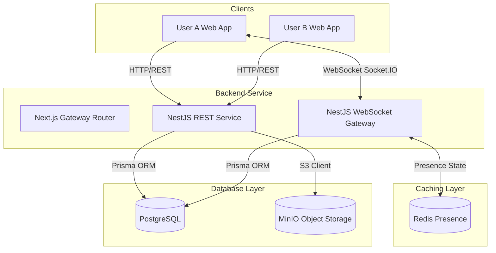
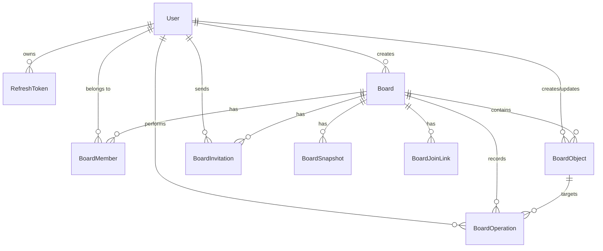

# Realtime Collaborative Tactical Whiteboard

[](https://www.typescriptlang.org/)
[](https://nextjs.org/)
[](https://nestjs.com/)
[](https://www.prisma.io/)
[](https://tailwindcss.com/)
[](https://socket.io/)
[](https://www.docker.com/)

Dự án **Realtime Collaborative Tactical Whiteboard** được phát triển cho chương trình **Viettel Digital Talent 2026 - Software Engineer Track**. Đây là một hệ thống monorepo cung cấp nền tảng bảng vẽ (whiteboard) cộng tác trực tuyến trên nền Web. Hệ thống cho phép nhiều người dùng tham gia vào cùng một phòng vẽ và tương tác với các đối tượng trên canvas ảo trong thời gian thực, hiển thị trạng thái hiện diện (presence), đồng bộ tránh xung đột chỉnh sửa và lưu trữ dữ liệu tập trung phía máy chủ.

---

## 1. Tính năng chính (Key Features)

* **Canvas vô hạn (Infinite Canvas):** Hỗ trợ kéo thả pan (chuột giữa hoặc phím Space) và phóng to/thu nhỏ (zoom) mượt mà xung quanh vị trí con trỏ chuột.
* **Hệ thống Công cụ Vẽ:** Vẽ các hình học cơ bản như hình chữ nhật (Rectangle), hình tròn (Circle), đường thẳng/đường mũi tên (Line/Arrow Line) và hộp văn bản (Text), đường vẽ tự do (Path), biểu tượng chiến thuật (Icon), và hỗ trợ tải ảnh cá nhân lên MinIO.
* **Thao tác Đối tượng trực quan:** Chọn đối tượng đơn lẻ hoặc quét chọn nhiều đối tượng (Lasso/Box Multi-select), hỗ trợ di chuyển, thay đổi kích thước, xoay, thay đổi lớp hiển thị (Z-Index) và xóa đối tượng.
* **Cộng tác Thời gian thực (Real-time Collaboration):** 
  * Thay đổi từ mỗi người dùng được cập nhật tức thì tới tất cả các thành viên khác trong phòng vẽ.
  * Hiển thị vị trí chuột kèm tên và ảnh đại diện của từng thành viên đang di chuyển trên màn hình (Live Cursors).
  * Danh sách thành viên trực tuyến trong thời gian thực (Presence) được quản lý và cache qua Redis.
* **Cơ chế Giải quyết Xung đột (Conflict Resolution):** 
  * Quản lý phiên bản trên từng đối tượng kết hợp lưu trữ nhật ký hoạt động (Operation Log) tập trung phía Server.
  * Đồng bộ hóa với cơ chế Optimistic UI ở Client để tăng tốc phản hồi trực quan, tự động rollback trạng thái về máy khách nếu có xung đột phiên bản chỉnh sửa xảy ra.
  * Snapshot định kỳ trạng thái của bảng vẽ để tối ưu thời gian tải ban đầu cho các thiết bị tham gia sau.
* **Quản lý Phòng & Lời mời:** 
  * Quản lý danh sách bảng vẽ cá nhân tại Dashboard.
  * Phân quyền truy cập rõ ràng (`OWNER`, `EDITOR`, `VIEWER`) cho các thành viên.
  * Mời cộng tác trực tiếp qua Email hoặc chia sẻ liên kết tham gia nhanh (Share Link).

---

## 2. Kiến trúc Monorepo & Công nghệ sử dụng

Dự án được tổ chức dưới dạng Monorepo sử dụng **Turborepo** và trình quản lý gói **pnpm** nhằm tối ưu hóa hiệu năng build và chia sẻ code:

### 2.1 Cấu trúc thư mục ứng dụng

* **apps/web**: Ứng dụng phía máy khách (Client app) xây dựng với **Next.js 16 (App Router)**, **React 19**, **React-Konva** (thư viện vẽ Canvas), **Zustand** (quản lý trạng thái), **Tailwind CSS v4** (giao diện) và **Socket.IO Client** để kết nối thời gian thực.
* **apps/api**: Ứng dụng phía máy chủ (Backend app) sử dụng framework **NestJS 11** để cung cấp các dịch vụ RESTful API, WebSocket Gateway (Socket.IO) và kết nối DB thông qua **Prisma ORM**.
* **packages/database**: Định nghĩa lược đồ cơ sở dữ liệu **PostgreSQL**, quản lý các tệp migration và sinh mã nguồn Prisma Client dùng chung.
* **packages/shared-contracts**: Nơi khai báo các kiểu dữ liệu chung (TypeScript interfaces) và schema xác thực dữ liệu **Zod** dùng chung cho cả Frontend và Backend, đảm bảo tính nhất quán của dữ liệu truyền nhận.

### 2.2 Sơ đồ kiến trúc hệ thống



---

## 3. Thiết kế Cơ sở dữ liệu

Dự án sử dụng cơ sở dữ liệu **PostgreSQL** kết hợp với **Prisma ORM**. Mô hình được thiết kế phân tách giữa **Trạng thái hiện tại** của các hình vẽ (`BoardObject`) và **Nhật ký thay đổi** lịch sử (`BoardOperation`) nhằm phục vụ cho cơ chế đồng bộ, khôi phục trạng thái và giải quyết xung đột khi cộng tác.

### 3.1 Sơ đồ quan hệ thực thể (ERD)



### 3.2 Mô tả các Model chính trong Schema

* **User**: Quản lý định danh người dùng, thông tin cá nhân và xác thực tài khoản.
* **RefreshToken**: Quản lý các mã refresh token phục vụ duy trì phiên đăng nhập và cơ chế quay vòng token (Token Rotation).
* **Board**: Đại diện cho phòng vẽ, lưu trữ siêu dữ liệu (metadata), số hiệu phiên bản hiện tại (currentRevision) và quyền truy cập mặc định (Private/Public).
* **BoardMember**: Quản lý thành viên tham gia phòng vẽ với các vai trò (`OWNER`, `EDITOR`, `VIEWER`).
* **BoardJoinLink**: Quản lý các đường dẫn liên kết tham gia nhanh cho phép người dùng tự tham gia vào Board với vai trò chỉ định.
* **BoardInvitation**: Lưu trữ thông tin lời mời tham gia phòng vẽ gửi qua Email của người dùng khác kèm theo token xác thực và thời gian hết hạn.
* **BoardObject**: Lưu trữ trạng thái hiện hữu của từng hình vẽ trên canvas (loại hình vẽ: `RECTANGLE`, `CIRCLE`, `LINE`, `TEXT`, `PATH`, `ICON`, `IMAGE`), tọa độ (`x`, `y`), thuộc tính style (kích thước, màu sắc, nét vẽ...), thứ tự hiển thị (`zIndex`) và `version` hiện tại của đối tượng đó.
* **BoardOperation**: Nhật ký ghi nhận tuần tự từng sự kiện thay đổi (`OBJECT_CREATE`, `OBJECT_UPDATE`, `OBJECT_DELETE`, `OBJECT_RESTORE`) liên kết trực tiếp tới số revision của phòng vẽ. Hỗ trợ dữ liệu đảo ngược (`inversePayload`) phục vụ tính năng hoàn tác.
* **BoardSnapshot**: Điểm lưu trữ nhanh trạng thái của toàn bộ Board tại một revision nhất định, giúp tối ưu hóa thời gian đồng bộ cho các thiết bị tham gia sau.

---

## 4. Cơ chế Đồng bộ hóa & Giải quyết xung đột

### 4.1 Luồng đồng bộ hóa tập trung (Server-Authoritative Sync)

Ứng dụng áp dụng luồng hoạt động ưu tiên máy chủ xác thực:

1. **Gửi yêu cầu thao tác**: Client thực hiện vẽ/chỉnh sửa trên canvas cục bộ (optimistic update ở phía UI để đảm bảo độ mượt mà) rồi phát đi một sự kiện Socket kèm theo các thay đổi và phiên bản hiện tại của hình vẽ (`baseObjectVersion`).
2. **Xác thực & Commit tại Server**: Server nhận được sự kiện sẽ kiểm tra quyền hạn của người dùng, đối chiếu `baseObjectVersion` với phiên bản hiện tại trong Database. Nếu hợp lệ, Server thực hiện lưu Database (cập nhật trạng thái hình vẽ và thêm vào nhật ký operation log), tăng giá trị `currentRevision` của phòng vẽ và gán revision này cho operation.
3. **Phát sóng (Broadcast)**: Server phản hồi lại cho Client gửi yêu cầu và phát sự kiện `operation:applied` đến tất cả các Client khác trong phòng để cập nhật canvas của họ.

### 4.2 Giải quyết xung đột dữ liệu (Optimistic Concurrency Control)

* **Kiểm tra phiên bản**: Khi người dùng muốn chỉnh sửa đối tượng, Server đối chiếu:
  `client.baseObjectVersion === server.currentObjectVersion`.
* **Nếu khớp (Thành công)**: Áp dụng thay đổi, nâng số version của đối tượng lên `version + 1` và cập nhật phòng vẽ.
* **Nếu không khớp (Xung đột)**: Thao tác bị bác bỏ. Server gửi thông báo lỗi (ví dụ: `operation:rejected`), Client thực hiện hoàn tác (rollback) trạng thái chỉnh sửa tạm thời và kéo trạng thái mới nhất của đối tượng từ máy chủ về.

### 4.3 Đồng bộ lại sau khi mất kết nối

Khi một Client kết nối lại sau khi bị mất mạng, nó gửi yêu cầu `sync:request` kèm theo số revision cuối cùng mà nó ghi nhận trước khi ngắt kết nối:

* Nếu khoảng cách revision nhỏ, Server chỉ gửi các bản ghi `BoardOperation` phát sinh trong giai đoạn mất kết nối để Client tự bù đắp trạng thái.
* Nếu khoảng cách quá lớn hoặc không xác định được revision, Server sẽ gửi toàn bộ trạng thái các đối tượng hiện tại (`BoardObject[]`) để Client dựng lại canvas mới nhất.

---

## 5. Hướng dẫn cài đặt & Chạy chương trình

### 5.1 Yêu cầu hệ thống (Prerequisites)

Để cài đặt và vận hành hệ thống, máy tính của bạn cần trang bị sẵn các công cụ sau:

* **Node.js** phiên bản 20 trở lên.
* **pnpm** phiên bản 10 trở lên (`npm install -g pnpm`).
* **Docker** & **Docker Compose** (để chạy các container dịch vụ đi kèm hoặc chạy toàn bộ ứng dụng).

### 5.2 Cấu hình Biến môi trường

Sao chép tệp cấu hình mẫu và điền đầy đủ các giá trị tương ứng trong tệp `.env` ở thư mục gốc:

```bash
cp .env.example .env
```

Các biến môi trường quan trọng cần cấu hình:
* `PORT` & `NGINX_PORT`: Cổng dịch vụ Backend và Proxy Nginx.
* `POSTGRES_DB`, `POSTGRES_USER`, `POSTGRES_PASSWORD`: Thông tin cấu hình cơ sở dữ liệu PostgreSQL.
* `GOOGLE_CLIENT_ID`: Định danh ứng dụng xác thực Google OAuth (đồng bộ biến client `NEXT_PUBLIC_GOOGLE_CLIENT_ID`).
* `MINIO_ACCESS_KEY`, `MINIO_SECRET_KEY`: Khóa quản trị dịch vụ lưu trữ file đám mây MinIO.
* `MAIL_SMTP_USER`, `MAIL_SMTP_PASSWORD`: Cấu hình tài khoản SMTP để gửi email mời tham gia phòng vẽ.

---

### 5.3 Lựa chọn 1: Chạy cục bộ dành cho phát triển (Local Development)

Nếu bạn muốn chạy ứng dụng cục bộ để chỉnh sửa mã nguồn:

#### Bước 1: Cài đặt toàn bộ dependencies trong monorepo
```bash
pnpm install
```

#### Bước 2: Khởi động các dịch vụ lưu trữ bằng Docker
Khởi chạy các cơ sở dữ liệu và hạ tầng phụ trợ thông qua Docker Compose ở chế độ chạy ngầm:
```bash
docker compose up -d postgres redis minio
```

#### Bước 3: Đồng bộ lược đồ cơ sở dữ liệu và tạo Prisma Client
Chạy lệnh di cư để khởi tạo cấu trúc bảng trên CSDL PostgreSQL:
```bash
pnpm --filter=@rctw/database db:migrate:dev
pnpm --filter=@rctw/database db:generate
```

#### Bước 4: Khởi động chế độ nhà phát triển (Development Mode)
Khởi chạy đồng thời cả frontend và backend sử dụng Turborepo:
```bash
pnpm dev
```

Ứng dụng mặc định sẽ chạy tại các địa chỉ:
* **Frontend (apps/web)**: `http://localhost:3000`
* **Backend API (apps/api)**: `http://localhost:3001`
* **MinIO Console**: `http://localhost:9001`

---

### 5.4 Lựa chọn 2: Chạy toàn bộ hệ thống bằng Docker Compose (Production Staging)

Để triển khai hoặc chạy thử toàn bộ hệ thống (gồm cả Web, API, Database, Cache, Object Storage, Nginx Reverse Proxy) trong môi trường khép kín:

#### Bước 1: Khởi động toàn bộ container
Ở thư mục chứa tệp `docker-compose.yml`, chạy lệnh sau:
```bash
docker compose up --build -d
```

Docker Compose sẽ tự động xây dựng hình ảnh (build image) cho Frontend và Backend, đồng thời cấu hình kết nối mạng nội bộ giữa các dịch vụ.

#### Bước 2: Truy cập ứng dụng
Sau khi tất cả container chuyển sang trạng thái hoạt động bình thường, bạn có thể truy cập hệ thống thông qua địa chỉ cổng dịch vụ của Nginx (mặc định cổng `8080`):
* Giao diện ứng dụng và API: `http://localhost:8080`
* Trang quản trị lưu trữ MinIO: `http://localhost:8080/minio-console`

Các cổng dịch vụ được cấu hình định tuyến thông qua tệp cấu hình Proxy `nginx.conf` của dự án.

---

## 6. Các lệnh script khả dụng trong dự án

Dưới đây là tổng hợp các lệnh run bằng `pnpm` được định nghĩa tại tệp `package.json` gốc:

| Lệnh | Ý nghĩa |
| :--- | :--- |
| `pnpm dev` | Khởi chạy tất cả các dự án ở chế độ watch (chạy thử realtime) |
| `pnpm dev:web` | Khởi chạy riêng ứng dụng Next.js Frontend |
| `pnpm dev:api` | Khởi chạy riêng ứng dụng NestJS Backend |
| `pnpm build` | Biên dịch dự án và tất cả packages dùng chung |
| `pnpm build:web` | Biên dịch phiên bản production cho Next.js Frontend |
| `pnpm build:api` | Biên dịch phiên bản production cho NestJS Backend |
| `pnpm lint` | Kiểm tra quy chuẩn viết code (eslint) trên toàn bộ dự án |
| `pnpm typecheck` | Kiểm tra lỗi tĩnh về kiểu dữ liệu TypeScript trên toàn dự án |
