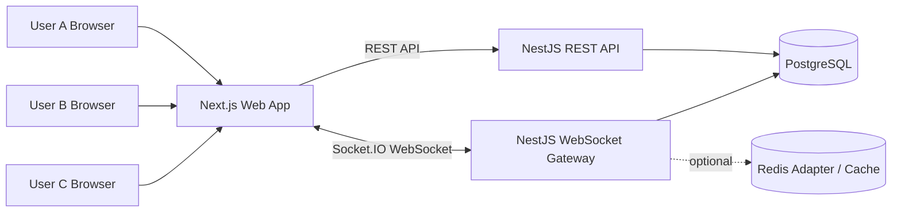
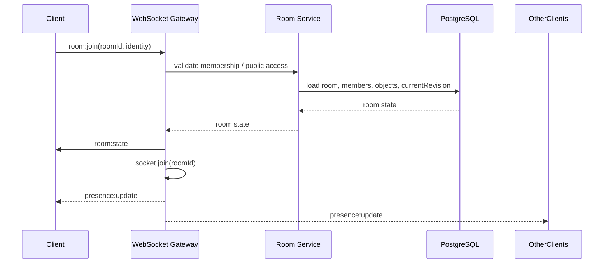
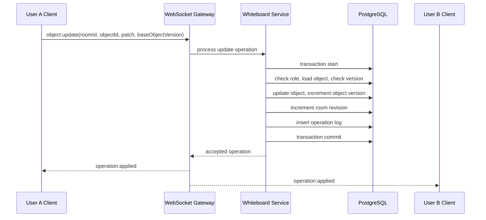
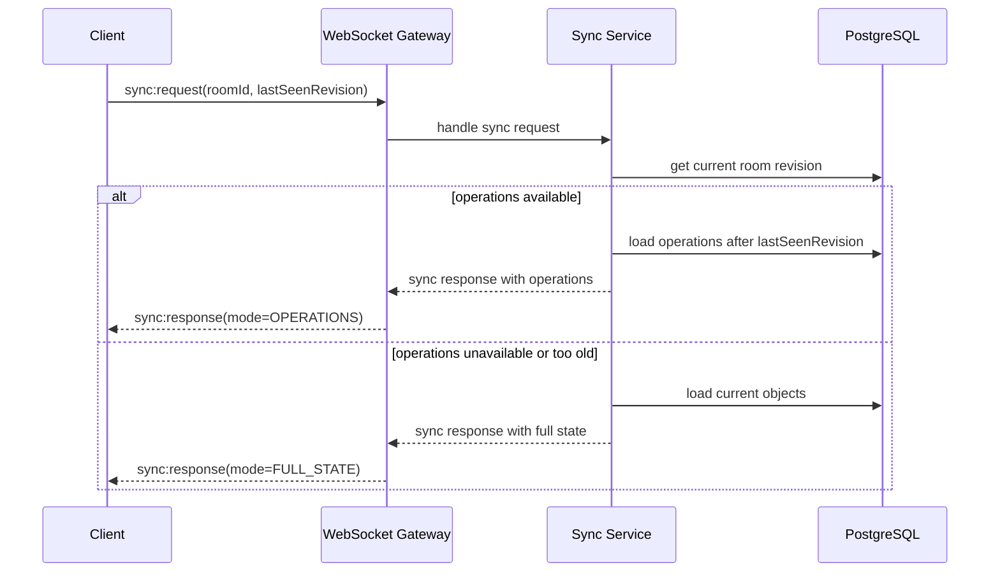
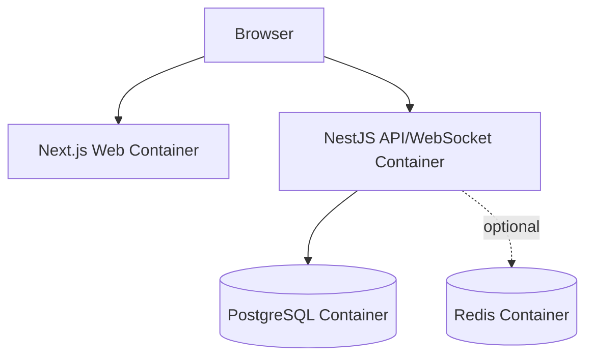

# 04. System Architecture Document

**Project:** Realtime Collaborative Tactical Whiteboard\
**Program:** Viettel Digital Talent 2026 — Software Engineer Track\
**Document version:** v0.1\
**Status:** Draft\
**Owner:** Tech Lead / Solution Architecture / Product Management

---

## 1. Purpose

This document defines the high-level system architecture for the **Realtime Collaborative Tactical Whiteboard** project.

The goal is to design a web-based collaborative whiteboard that allows multiple users to work in the same tactical planning room, manipulate objects on a virtual canvas, and synchronize changes in realtime through WebSocket while persisting data on the server.

This document focuses on:

- System decomposition
- Frontend architecture
- Backend architecture
- Realtime architecture
- Persistence architecture
- Deployment architecture
- Main data flows
- Technical trade-offs

---

## 2. Architecture Goals

The architecture must satisfy the following goals:

| Goal                       | Description                                                                                              |
| -------------------------- | -------------------------------------------------------------------------------------------------------- |
| Realtime collaboration     | Multiple users in the same room must see object changes, cursor movement, and online status in realtime. |
| Server-authoritative state | The server is the source of truth for persisted canvas state and accepted operations.                    |
| Persistence                | Reloading or reconnecting must not lose canvas data.                                                     |
| Conflict-aware editing     | Concurrent edits must be handled through exact object version checks and server-side operation ordering. |
| Maintainability            | Frontend, backend, shared contracts, database schema, and realtime protocol should be separated clearly. |
| Demo reliability           | The system must support a stable demo with 3 users and target testing with 5 users in one room.          |
| 5-week feasibility         | The architecture must be strong enough for technical evaluation but not over-engineered.                 |

---

## 3. Architecture Style

The system uses a **client-server architecture** with a **server-authoritative realtime synchronization model**.

Key decisions:

```txt
Frontend renders and manipulates canvas state locally.
Client sends user operations to backend through WebSocket.
Backend validates permission, version, and payload.
Backend persists accepted operations and current object state.
Backend broadcasts accepted operations to other clients in the same room.
Clients apply server-approved operations to local state.
```

The system does **not** use CRDT/Yjs in the MVP. CRDT-based synchronization is considered a future enhancement.

---

## 4. High-Level System Context



### Main components

| Component                | Responsibility                                                                                   |
| ------------------------ | ------------------------------------------------------------------------------------------------ |
| Next.js Web App          | User interface, canvas rendering, room pages, object detail panel, realtime client state.        |
| React-Konva Canvas       | Canvas object rendering, selection, transform, drag, resize, rotate.                             |
| Zustand Store            | Local whiteboard state, selected object, current tool, online users, cursors, connection status. |
| NestJS REST API          | Auth/guest identity, room CRUD, member/role APIs, object loading, operation history.             |
| NestJS WebSocket Gateway | Room join/leave, object operations, cursor/presence, reconnect sync.                             |
| PostgreSQL               | Persistent room data, object current state, operation log, snapshots, users/members.             |
| Redis                    | Optional future adapter/cache for multi-instance WebSocket scaling. Not required in MVP.         |

---

## 5. Technology Stack

| Layer            | Technology               | Decision                                                                    |
| ---------------- | ------------------------ | --------------------------------------------------------------------------- |
| Monorepo         | Turborepo                | Required for shared contracts and coordinated frontend/backend development. |
| Package manager  | pnpm                     | Recommended for monorepo performance and workspace management.              |
| Frontend         | Next.js                  | Main web framework.                                                         |
| UI               | shadcn/ui + Tailwind CSS | Fast, consistent, clean UI.                                                 |
| Canvas           | React-Konva / Konva      | Object-based canvas interaction, transform support, hit detection.          |
| State management | Zustand                  | Lightweight client state store for canvas and realtime state.               |
| Backend          | NestJS                   | Modular backend with REST + WebSocket Gateway.                              |
| Realtime         | Socket.IO                | Room-based broadcasting, reconnect support, browser compatibility.          |
| ORM              | Prisma                   | Type-safe PostgreSQL access and migrations.                                 |
| Database         | PostgreSQL               | Persistent relational data, JSON fields for flexible canvas payloads.       |
| Validation       | Zod                      | Shared DTO and event payload validation across frontend/backend.            |
| Deployment       | Docker Compose           | Required for local reproducible demo.                                       |
| Optional scale   | Redis                    | Optional Socket.IO adapter if multiple backend instances are used.          |

---

## 6. Monorepo Structure

Recommended structure:

```txt
realtime-collaborative-tactical-whiteboard/
├── apps/
│   ├── web/                         # Next.js frontend
│   └── api/                         # NestJS backend
├── packages/
│   ├── shared-contracts/            # Zod schemas, DTOs, event contracts
│   ├── database/                    # Prisma schema, migrations, seed
│   └── config/                      # Shared tsconfig/eslint/prettier optional
├── docs/                            # Project documents
├── docker-compose.yml
├── package.json
├── pnpm-workspace.yaml
├── turbo.json
└── README.md
```

### Rationale

- `apps/web` and `apps/api` stay independently runnable.
- `packages/shared-contracts` prevents frontend/backend payload mismatch.
- `packages/database` centralizes Prisma schema and migrations.
- `docs` stores technical planning and report materials.

---

## 7. Frontend Architecture

### 7.1 Responsibilities

The frontend is responsible for:

- Rendering room and whiteboard pages.
- Rendering canvas objects using React-Konva.
- Handling local interactions: select, draw, move, resize, rotate, delete, zoom, pan.
- Maintaining local UI state and optimistic/transient state.
- Connecting to WebSocket and applying server-approved operations.
- Displaying online users and cursors.
- Displaying object detail panel.
- Showing conflict/reconnect/error feedback to the user.

The frontend is **not** the source of truth for persisted state.

---

### 7.2 Frontend folder structure

```txt
apps/web/src/
├── app/
│   ├── page.tsx
│   ├── rooms/
│   │   ├── page.tsx
│   │   └── [roomId]/
│   │       └── page.tsx
│   └── layout.tsx
├── components/
│   ├── canvas/
│   │   ├── whiteboard-stage.tsx
│   │   ├── whiteboard-layer.tsx
│   │   ├── shape-renderer.tsx
│   │   ├── object-transformer.tsx
│   │   └── remote-cursor-layer.tsx
│   ├── toolbar/
│   │   ├── tool-palette.tsx
│   │   └── zoom-controls.tsx
│   ├── room/
│   │   ├── room-header.tsx
│   │   ├── online-users.tsx
│   │   └── room-list.tsx
│   ├── inspector/
│   │   └── object-detail-panel.tsx
│   └── ui/
├── features/
│   ├── identity/
│   ├── rooms/
│   ├── whiteboard/
│   └── realtime/
├── stores/
│   └── whiteboard-store.ts
├── lib/
│   ├── api-client.ts
│   ├── socket-client.ts
│   └── canvas-utils.ts
└── types/
```

---

### 7.3 Frontend state model

```ts
type WhiteboardStore = {
    roomId: string | null;
    revision: number;
    objects: Record<string, WhiteboardObject>;
    selectedObjectId: string | null;
    currentTool: Tool;
    onlineUsers: OnlineUser[];
    cursors: Record<string, CursorState>;
    connectionStatus: "connected" | "disconnected" | "reconnecting";
    viewport: {
        x: number;
        y: number;
        scale: number;
    };

    setRoomState: (state: RoomStatePayload) => void;
    applyOperation: (operation: ServerOperation) => void;
    upsertObject: (object: WhiteboardObject) => void;
    removeObject: (objectId: string) => void;
    selectObject: (objectId: string | null) => void;
    setTool: (tool: Tool) => void;
    setConnectionStatus: (status: ConnectionStatus) => void;
};
```

---

### 7.4 Frontend interaction principle

| Interaction   | Local behavior                                       | Server behavior                                    |
| ------------- | ---------------------------------------------------- | -------------------------------------------------- |
| Create object | Create draft/default object locally after click/drag | Send `object:create`, wait for accepted operation. |
| Move object   | Local preview during drag                            | Persist final update on drag end.                  |
| Resize/rotate | Local preview during transform                       | Persist final update on transform end.             |
| Delete object | Remove locally after server acceptance               | Send `object:delete`.                              |
| Cursor move   | Update local cursor position                         | Send throttled `cursor:update`; not persisted.     |
| Zoom/pan      | Local only                                           | Not sent to server.                                |
| Reconnect     | Show reconnect status                                | Send `sync:request`.                               |

---

## 8. Backend Architecture

### 8.1 Responsibilities

The backend is responsible for:

- Managing users/guest identities.
- Managing rooms and room membership.
- Enforcing owner/editor/viewer permissions.
- Validating REST and WebSocket payloads.
- Processing object operations.
- Maintaining current object state.
- Persisting operation log and room revision.
- Synchronizing clients in realtime.
- Serving reconnect recovery data.

---

### 8.2 Backend module structure

```txt
apps/api/src/
├── app.module.ts
├── permissions/                    # Role checks and guards
├── common/                         # Errors, filters, interceptors, utility types
├── infrastructure/                 # Database module, WebSocket gateway, configuration
|   ├── cache/                      # Optional Redis cache or Socket.IO adapter
|   └── database/                   # Database connection, Prisma service
└── modules/
    ├── auth/                       # Guest identity, optional Google OAuth/JWT
    ├── users/                      # User profile and identity data
    ├── rooms/                      # Room CRUD, room members, roles
    ├── whiteboard/                 # Object state, operation processing, snapshots
    ├── realtime/                   # Socket.IO Gateway and event routing
    └── presence/                   # Online users and cursor state
```

---

### 8.3 Backend module responsibility matrix

| Module            | Responsibility                                                           |
| ----------------- | ------------------------------------------------------------------------ |
| AuthModule        | Guest identity in MVP, optional Google OAuth/JWT later.                  |
| UsersModule       | User profile, display name, avatar URL/color.                            |
| RoomsModule       | Create/list/update/delete rooms, room membership, default role.          |
| WhiteboardModule  | Create/update/delete objects, operation log, conflict checks, snapshots. |
| RealtimeModule    | WebSocket gateway, room join/leave, event dispatching.                   |
| PresenceModule    | Online users, cursor position, selected object, editing status.          |
| PermissionsModule | Role-based authorization for REST and WebSocket events.                  |
| PrismaModule      | Database access.                                                         |

---

## 9. Realtime Architecture

### 9.1 Realtime model

The realtime model is based on:

```txt
Server-authoritative state
Room-based broadcasting
Operation log
Room revision
Object version
Reconnect replay/fallback
```

### 9.2 Room-based communication

Each socket joins a Socket.IO room matching the whiteboard room ID:

```txt
socket.join(`room:${roomId}`)
```

Broadcast pattern:

```txt
server.to(`room:${roomId}`).emit(eventName, payload)
```

Events must never be broadcast globally unless explicitly required.

---

### 9.3 Persistent vs transient events

| Event category          | Examples                                    | Persisted? | Increments revision? |
| ----------------------- | ------------------------------------------- | ---------- | -------------------- |
| Persistent operation    | object:create, object:update, object:delete | Yes        | Yes                  |
| Transient collaboration | cursor:update, presence:update, editing:start, editing:end, object:transform-preview | No | No |
| Sync lifecycle          | room:join, room:state, sync:request         | No         | No                   |

---

## 10. Persistence Architecture

The system uses two persistence layers:

### 10.1 Current state

Stored in `WhiteboardObject`.

Purpose:

- Fast room loading.
- Current canvas rendering.
- Exact object-level version checks.
- No field-level merge for stale updates in the MVP.

### 10.2 Operation log

Stored in `WhiteboardOperation`.

Purpose:

- Reconnect synchronization.
- Conflict analysis.
- Undo/redo support.
- Operation history UI.
- Technical audit trail.

### 10.3 Snapshot

Stored in `RoomSnapshot`.

Purpose:

- Future optimization.
- Fallback synchronization.
- Avoid replaying too many operations.

Snapshot UI is not required in MVP.

---

## 11. Core Data Flows

## 11.1 Join room flow



---

## 11.2 Object update flow



---

## 11.3 Reconnect sync flow



---

## 12. Deployment Architecture

### 12.1 Local development and demo

Docker Compose should run:

```txt
web        Next.js frontend
api        NestJS backend
postgres   PostgreSQL database
redis      optional, disabled or unused in MVP
```

Recommended local ports:

| Service        | Port |
| -------------- | ---- |
| Web            | 3000 |
| API            | 3001 |
| PostgreSQL     | 5432 |
| Redis optional | 6379 |

---

### 12.2 Deployment diagram



---

## 13. Security Architecture

### 13.1 MVP identity

MVP supports guest identity:

```txt
User enters displayName.
Server creates or resolves guest session.
User receives a guest identity token/session identifier.
User can join public rooms by link.
```

### 13.2 Should-have identity

Google OAuth is a should-have enhancement:

```txt
User logs in using Google OAuth.
Server stores name, email, avatarUrl.
Server issues JWT Bearer token.
Frontend sends Authorization: Bearer <token> for REST and WebSocket authentication.
```

### 13.3 Authorization

All mutating operations must be checked server-side.

```txt
Owner: edit canvas, delete room, change role, view history.
Editor: edit canvas, view history.
Viewer: view canvas, view cursor/presence/history, cannot edit.
```

Client-side UI restrictions are only convenience. They are not security.

---

## 14. Technical Trade-Offs

| Decision                      | Alternative           | Reason                                                                   |
| ----------------------------- | --------------------- | ------------------------------------------------------------------------ |
| Server-authoritative sync     | CRDT/Yjs              | Easier to implement, easier to explain, enough for 5-week project.       |
| Operation log + current state | One large JSON canvas | Better reconnect, conflict handling, history, and report quality.        |
| React-Konva                   | Raw Canvas            | Faster implementation of object selection, drag, transform, hit testing. |
| Zustand                       | Redux Toolkit         | Simpler state management for canvas-heavy UI.                            |
| Socket.IO                     | Native WebSocket      | Built-in rooms, reconnect behavior, browser compatibility.               |
| Guest identity first          | Google OAuth first    | Prevents auth from delaying realtime core.                               |
| Large virtual canvas          | True infinite canvas  | Feasible for MVP while still supporting pan/zoom experience.             |

---

## 15. Scalability Considerations

MVP targets a single backend instance.

Future scaling path:

```txt
1. Add Redis Socket.IO adapter for multi-instance WebSocket broadcasting.
2. Add Redis cache for room presence and cursor state.
3. Add snapshot compaction to avoid large operation replay.
4. Add spatial indexing or viewport culling for very large object counts.
5. Add object pagination or tile-based loading if canvas grows substantially.
```

These are not MVP requirements.

---

## 16. Architecture Risks

| Risk                          | Impact               | Mitigation                                                       |
| ----------------------------- | -------------------- | ---------------------------------------------------------------- |
| Canvas interaction complexity | Delays MVP           | Use React-Konva and limit to single-select.                      |
| Realtime race conditions      | Inconsistent state   | Server-authoritative operations, DB transactions, room revision. |
| Conflict handling complexity  | Bugs and unclear UX  | Exact object version check + reject stale/deleted updates.       |
| OAuth delays                  | Delays realtime core | Guest identity first, Google OAuth as should-have.               |
| Infinite canvas complexity    | Performance issues   | Use large virtual canvas, not true infinite canvas.              |
| Operation log grows large     | Slow reconnect       | Snapshot schema and latest-state fallback.                       |

---

## 17. Final Architecture Decision

The official architecture for the MVP is:

```txt
Monorepo:
- Turborepo + pnpm

Frontend:
- Next.js
- React-Konva
- Zustand
- shadcn/ui
- Socket.IO client

Backend:
- NestJS
- REST API
- Socket.IO Gateway
- Prisma
- PostgreSQL

Realtime:
- Server-authoritative
- Room-based broadcasting
- Persistent object operations
- Transient cursor/presence events
- Exact object version conflict detection
- Room revision ordering
- Reconnect replay/fallback

Persistence:
- WhiteboardObject current state
- WhiteboardOperation operation log
- RoomSnapshot optional fallback/future optimization

Deployment:
- Docker Compose local mandatory
- VPS deployment bonus
```
