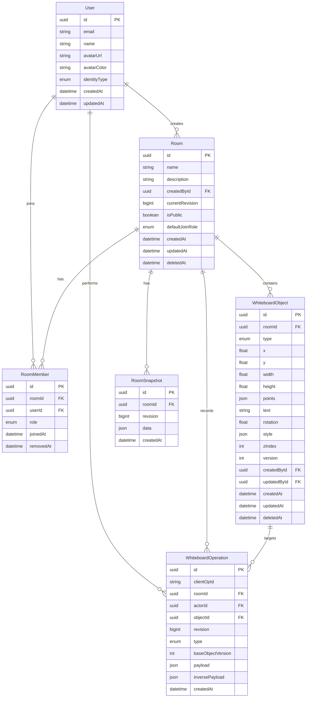

# 06. Database Design Document

**Project:** Realtime Collaborative Tactical Whiteboard\
**Program:** Viettel Digital Talent 2026 — Software Engineer Track\
**Document version:** v0.1\
**Status:** Draft

---

## 1. Purpose

This document defines the database design for the **Realtime Collaborative Tactical Whiteboard** project.

The database must support:

- User/guest identity
- Room management
- Room membership and roles
- Current whiteboard object state
- Operation log for realtime synchronization and history
- Reconnect recovery
- Undo/redo support
- Optional snapshots for future optimization

---

## 2. Database Technology

The project uses:

```txt
PostgreSQL + Prisma ORM v7
```

Rationale:

- PostgreSQL provides strong transaction support.
- Prisma provides type-safe database access.
- JSON fields are useful for canvas object style, operation payloads, and snapshot data.
- Relational tables fit room, member, user, and operation relationships well.

---

## 3. Design Principles

| Principle                               | Description                                                                                  |
| --------------------------------------- | -------------------------------------------------------------------------------------------- |
| Current state and history are separated | `WhiteboardObject` stores current state; `WhiteboardOperation` stores historical operations. |
| Server-authoritative persistence        | The server writes accepted operations and current object state.                              |
| Soft delete for objects                 | Deleted objects keep historical data for undo/history.                                       |
| Room-level revision                     | Every accepted persistent operation increments room revision.                                |
| Object-level versioning                 | Each object has a version for conflict detection.                                            |
| Flexible shape data                     | JSON fields store style and operation payloads.                                              |
| Queryable core fields                   | Frequently used fields like x, y, width, height, version, type remain normal columns.        |

---

## 4. Entity Relationship Overview



---

## 5. Tables

## 5.1 User

Stores authenticated or guest users.

### Fields

| Field        | Type     | Required | Description                                    |
| ------------ | -------- | -------- | ---------------------------------------------- |
| id           | UUID     | Yes      | Primary key.                                   |
| email        | String?  | No       | Email from Google OAuth. Null for guest users. |
| name         | String   | Yes      | Display name.                                  |
| avatarUrl    | String?  | No       | Avatar from OAuth profile.                     |
| avatarColor  | String   | Yes      | UI color for cursor/presence.                  |
| identityType | Enum     | Yes      | `GUEST` or `GOOGLE`.                           |
| createdAt    | DateTime | Yes      | Creation time.                                 |
| updatedAt    | DateTime | Yes      | Update time.                                   |

### Notes

- MVP supports guest identity.
- Google OAuth is a should-have enhancement.
- `avatarColor` is used for cursor and online user display.

---

## 5.2 Room

Stores whiteboard rooms.

### Fields

| Field           | Type      | Required | Description                                    |
| --------------- | --------- | -------- | ---------------------------------------------- |
| id              | UUID      | Yes      | Primary key.                                   |
| name            | String    | Yes      | Room name.                                     |
| description     | String?   | No       | Optional room description.                     |
| createdById     | UUID      | Yes      | Owner/creator user ID.                         |
| currentRevision | BigInt    | Yes      | Latest accepted persistent operation revision. |
| isPublic        | Boolean   | Yes      | Whether users can join by link.                |
| defaultJoinRole | Enum      | Yes      | Default role for users joining public room.    |
| createdAt       | DateTime  | Yes      | Creation time.                                 |
| updatedAt       | DateTime  | Yes      | Update time.                                   |
| deletedAt       | DateTime? | No       | Soft delete timestamp.                         |

### Notes

- Public rooms can be joined by link.
- Private invite flow is should-have.
- `currentRevision` is critical for sync and operation ordering.
- `currentRevision` is stored as `BigInt` in PostgreSQL/Prisma, but REST and WebSocket responses serialize it as `number` for the MVP.

---

## 5.3 RoomMember

Stores user membership and role per room.

### Fields

| Field     | Type      | Required | Description                       |
| --------- | --------- | -------- | --------------------------------- |
| id        | UUID      | Yes      | Primary key.                      |
| roomId    | UUID      | Yes      | Room ID.                          |
| userId    | UUID      | Yes      | User ID.                          |
| role      | Enum      | Yes      | `OWNER`, `EDITOR`, `VIEWER`.      |
| joinedAt  | DateTime  | Yes      | Join time.                        |
| removedAt | DateTime? | No       | Removal time if user was removed. |

### Unique constraint

```txt
unique(roomId, userId)
```

### Role rules

| Role   | Permission summary                                                 |
| ------ | ------------------------------------------------------------------ |
| OWNER  | Full control: edit canvas, delete room, change role, view history. |
| EDITOR | Edit canvas and view history.                                      |
| VIEWER | View room, objects, cursor, online users, history. Cannot edit.    |

---

## 5.4 WhiteboardObject

Stores current state of canvas objects.

### Object types

```txt
RECTANGLE
CIRCLE
LINE
TEXT
```

### Fields

| Field       | Type      | Required | Description                                    |
| ----------- | --------- | -------- | ---------------------------------------------- |
| id          | UUID      | Yes      | Primary key.                                   |
| roomId      | UUID      | Yes      | Room that contains the object.                 |
| type        | Enum      | Yes      | Object type.                                   |
| x           | Float     | Yes      | Object x coordinate.                           |
| y           | Float     | Yes      | Object y coordinate.                           |
| width       | Float?    | No       | Width for rectangle/circle/text bounding box.  |
| height      | Float?    | No       | Height for rectangle/circle/text bounding box. |
| points      | Json?     | No       | Line points: `[x1, y1, x2, y2]`.               |
| text        | String?   | No       | Text content for text object.                  |
| rotation    | Float     | Yes      | Rotation in degrees.                           |
| style       | Json      | Yes      | Fill, stroke, font, arrow style, opacity.      |
| zIndex      | Int       | Yes      | Render ordering.                               |
| version     | Int       | Yes      | Object version for conflict detection.         |
| createdById | UUID      | Yes      | Creator user ID.                               |
| updatedById | UUID?     | No       | Last updater user ID.                          |
| createdAt   | DateTime  | Yes      | Creation time.                                 |
| updatedAt   | DateTime  | Yes      | Update time.                                   |
| deletedAt   | DateTime? | No       | Soft delete timestamp.                         |

### Notes

- `CIRCLE` uses `width` and `height` instead of radius.
- If width equals height, it behaves like a circle.
- If width differs from height after resize, it behaves like an ellipse.
- `LINE` supports arrow line through style fields such as `arrowStart` and `arrowEnd`.

---

## 5.5 WhiteboardOperation

Stores accepted persistent operations.

### Fields

| Field             | Type     | Required | Description                                                                   |
| ----------------- | -------- | -------- | ----------------------------------------------------------------------------- |
| id                | UUID     | Yes      | Primary key.                                                                  |
| clientOpId        | String   | Yes      | Client-generated operation ID for idempotency.                                |
| roomId            | UUID     | Yes      | Target room ID.                                                               |
| actorId           | UUID     | Yes      | User who performed operation.                                                 |
| objectId          | UUID?    | No       | Target object ID. Null only for special room-level operations if added later. |
| revision          | BigInt   | Yes      | Room revision assigned by server.                                             |
| type              | Enum     | Yes      | Operation type.                                                               |
| baseObjectVersion | Int?     | No       | Object version seen by client before operation.                               |
| payload           | Json     | Yes      | Operation payload.                                                            |
| inversePayload    | Json?    | No       | Data needed for undo/history.                                                 |
| createdAt         | DateTime | Yes      | Operation timestamp.                                                          |

### Operation types

```txt
OBJECT_CREATE
OBJECT_UPDATE
OBJECT_DELETE
OBJECT_RESTORE
```

### Constraints

```txt
unique(roomId, clientOpId)
unique(roomId, revision)
```

---

## 5.6 RoomSnapshot

Stores snapshot of room state at a specific revision.

### Fields

| Field     | Type     | Required | Description             |
| --------- | -------- | -------- | ----------------------- |
| id        | UUID     | Yes      | Primary key.            |
| roomId    | UUID     | Yes      | Room ID.                |
| revision  | BigInt   | Yes      | Snapshot revision.      |
| data      | Json     | Yes      | Snapshot object data.   |
| createdAt | DateTime | Yes      | Snapshot creation time. |

### Notes

- Snapshot UI is not required in MVP.
- Snapshot schema is useful for future optimization and fallback synchronization.

---

## 6. Prisma Schema Draft

```prisma
model User {
  id           String       @id @default(uuid()) @db.Uuid
  email        String?      @unique
  name         String       @db.VarChar(120)
  avatarUrl    String?      @db.Text
  avatarColor  String       @default("#3B82F6") @db.VarChar(20)
  identityType IdentityType @default(GUEST)
  createdAt    DateTime     @default(now()) @db.Timestamptz(6)
  updatedAt    DateTime     @updatedAt @db.Timestamptz(6)

  createdRooms Room[]                @relation("RoomCreator")
  memberships  RoomMember[]
  operations   WhiteboardOperation[]
  objectsCreated WhiteboardObject[]  @relation("ObjectCreator")
  objectsUpdated WhiteboardObject[]  @relation("ObjectUpdater")
}

model Room {
  id              String    @id @default(uuid()) @db.Uuid
  name            String    @db.VarChar(160)
  description     String?   @db.Text
  createdById     String    @db.Uuid
  currentRevision BigInt    @default(0)
  isPublic        Boolean   @default(true)
  defaultJoinRole RoomRole  @default(EDITOR)
  createdAt       DateTime  @default(now()) @db.Timestamptz(6)
  updatedAt       DateTime  @updatedAt @db.Timestamptz(6)
  deletedAt       DateTime? @db.Timestamptz(6)

  createdBy  User                  @relation("RoomCreator", fields: [createdById], references: [id])
  members    RoomMember[]
  objects    WhiteboardObject[]
  operations WhiteboardOperation[]
  snapshots  RoomSnapshot[]

  @@index([createdById])
  @@index([isPublic])
  @@index([deletedAt])
}

model RoomMember {
  id        String    @id @default(uuid()) @db.Uuid
  roomId    String    @db.Uuid
  userId    String    @db.Uuid
  role      RoomRole
  joinedAt  DateTime  @default(now()) @db.Timestamptz(6)
  removedAt DateTime? @db.Timestamptz(6)

  room Room @relation(fields: [roomId], references: [id])
  user User @relation(fields: [userId], references: [id])

  @@unique([roomId, userId])
  @@index([roomId, role])
  @@index([userId])
}

model WhiteboardObject {
  id          String     @id @default(uuid()) @db.Uuid
  roomId      String     @db.Uuid
  type        ObjectType
  x           Float
  y           Float
  width       Float?
  height      Float?
  points      Json?
  text        String?    @db.Text
  rotation    Float      @default(0)
  style       Json
  zIndex      Int        @default(0)
  version     Int        @default(1)
  createdById String     @db.Uuid
  updatedById String?    @db.Uuid
  createdAt   DateTime   @default(now()) @db.Timestamptz(6)
  updatedAt   DateTime   @updatedAt @db.Timestamptz(6)
  deletedAt   DateTime?  @db.Timestamptz(6)

  room      Room  @relation(fields: [roomId], references: [id])
  createdBy User  @relation("ObjectCreator", fields: [createdById], references: [id])
  updatedBy User? @relation("ObjectUpdater", fields: [updatedById], references: [id])
  operations WhiteboardOperation[]

  @@index([roomId])
  @@index([roomId, deletedAt])
  @@index([roomId, zIndex])
  @@index([createdById])
}

model WhiteboardOperation {
  id                String        @id @default(uuid()) @db.Uuid
  clientOpId        String        @db.VarChar(120)
  roomId            String        @db.Uuid
  actorId           String        @db.Uuid
  objectId          String?       @db.Uuid
  revision          BigInt
  type              OperationType
  baseObjectVersion Int?
  payload           Json
  inversePayload    Json?
  createdAt         DateTime      @default(now()) @db.Timestamptz(6)

  room   Room              @relation(fields: [roomId], references: [id])
  actor  User              @relation(fields: [actorId], references: [id])
  object WhiteboardObject? @relation(fields: [objectId], references: [id])

  @@unique([roomId, clientOpId])
  @@unique([roomId, revision])
  @@index([roomId, revision])
  @@index([objectId])
  @@index([actorId])
  @@index([createdAt])
}

model RoomSnapshot {
  id        String   @id @default(uuid()) @db.Uuid
  roomId    String   @db.Uuid
  revision  BigInt
  data      Json
  createdAt DateTime @default(now()) @db.Timestamptz(6)

  room Room @relation(fields: [roomId], references: [id])

  @@unique([roomId, revision])
  @@index([roomId, revision])
}

enum IdentityType {
  GUEST
  GOOGLE
}

enum RoomRole {
  OWNER
  EDITOR
  VIEWER
}

enum ObjectType {
  RECTANGLE
  CIRCLE
  LINE
  TEXT
}

enum OperationType {
  OBJECT_CREATE
  OBJECT_UPDATE
  OBJECT_DELETE
  OBJECT_RESTORE
}
```

---

## 7. Object Style Schema

The `style` JSON field should follow a controlled structure.

```ts
type ShapeStyle = {
    fill?: string;
    stroke?: string;
    strokeWidth?: number;
    opacity?: number;
    fontSize?: number;
    fontFamily?: string;
    fontWeight?: "normal" | "bold";
    color?: string;
    arrowStart?: boolean;
    arrowEnd?: boolean;
};
```

Validation must be done using shared Zod schemas.

---

## 8. Operation Payload Schema

## 8.1 OBJECT_CREATE payload

```ts
type ObjectCreatePayload = {
    object: WhiteboardObject;
};
```

## 8.2 OBJECT_UPDATE payload

```ts
type ObjectMutablePatch = Partial<{
    x: number;
    y: number;
    width: number;
    height: number;
    points: number[];
    text: string;
    rotation: number;
    style: ShapeStyle;
    zIndex: number;
}>;

type ObjectUpdatePayload = {
    objectId: string;
    patch: ObjectMutablePatch;
    previousValues?: ObjectMutablePatch;
    resultingObject: WhiteboardObject;
};
```

Only mutable canvas fields are allowed in `patch`. Clients must not patch identity, ownership, version, timestamp, room, or deletion fields.

## 8.3 OBJECT_DELETE payload

```ts
type ObjectDeletePayload = {
    objectId: string;
    previousObject: WhiteboardObject;
};
```

## 8.4 OBJECT_RESTORE payload

```ts
type ObjectRestorePayload = {
    objectId: string;
    restoredObject: WhiteboardObject;
};
```

---

## 9. Index Strategy

| Table               | Index                         | Purpose                          |
| ------------------- | ----------------------------- | -------------------------------- |
| Room                | `createdById`                 | List rooms created by user.      |
| Room                | `deletedAt`                   | Exclude deleted rooms.           |
| RoomMember          | `(roomId, userId)` unique     | Fast membership and role lookup. |
| RoomMember          | `(roomId, role)`              | Query members by role.           |
| WhiteboardObject    | `roomId`                      | Load objects by room.            |
| WhiteboardObject    | `(roomId, deletedAt)`         | Load active objects.             |
| WhiteboardObject    | `(roomId, zIndex)`            | Render objects in order.         |
| WhiteboardOperation | `(roomId, revision)`          | Reconnect sync and history.      |
| WhiteboardOperation | `(roomId, clientOpId)` unique | Idempotency.                     |
| RoomSnapshot        | `(roomId, revision)` unique   | Load snapshot by revision.       |

---

## 10. Transaction Strategy

## 10.1 Create object transaction

```txt
1. Check room exists and not deleted.
2. Check actor is OWNER or EDITOR.
3. Create WhiteboardObject with version = 1.
4. Increment Room.currentRevision.
5. Insert WhiteboardOperation with new revision.
6. Commit.
```

---

## 10.2 Update object transaction

```txt
1. Check room exists and not deleted.
2. Check actor is OWNER or EDITOR.
3. Load object by objectId and roomId.
4. Reject if object does not exist or deletedAt is not null.
5. Reject if baseObjectVersion does not match the current object version.
6. Apply patch.
7. Increment object.version.
8. Increment Room.currentRevision.
9. Insert WhiteboardOperation with payload and inversePayload.
10. Commit.
```

---

## 10.3 Delete object transaction

```txt
1. Check room exists and not deleted.
2. Check actor is OWNER or EDITOR.
3. Load object by objectId and roomId.
4. Reject if object does not exist or already deleted.
5. Reject if baseObjectVersion does not match the current object version.
6. Set object.deletedAt.
7. Increment object.version.
8. Increment Room.currentRevision.
9. Insert WhiteboardOperation with previous object data.
10. Commit.
```

---

## 11. Soft Delete Policy

Soft delete applies to:

```txt
Room
WhiteboardObject
RoomMember removal
```

Rules:

```txt
- Deleted objects are excluded from normal canvas loading.
- Deleted objects can still be referenced by operation history.
- Undo may restore deleted objects if version/permission checks pass.
- Hard delete is not used in MVP.
```

---

## 12. Data Loading Patterns

## 12.1 Load room state

Used when joining/reloading a room.

```txt
1. Load room by roomId.
2. Validate access.
3. Load active objects where deletedAt is null.
4. Order by zIndex ASC, createdAt ASC.
5. Load online users from presence memory, not database.
6. Return room state with currentRevision.
```

---

## 12.2 Load operation history

Used for history UI.

```txt
WHERE roomId = :roomId
ORDER BY revision DESC
LIMIT 50
```

---

## 12.3 Load operations for reconnect

Used for sync replay.

```txt
WHERE roomId = :roomId
AND revision > :lastSeenRevision
ORDER BY revision ASC
```

If operation count is too high or unavailable, return full state.

---

## 13. Seed Data Plan

Seed data should include:

```txt
Users:
- Owner Demo
- Editor Demo
- Viewer Demo

Room:
- Emergency Response Demo Room

Members:
- Owner Demo as OWNER
- Editor Demo as EDITOR
- Viewer Demo as VIEWER

Objects:
- Rectangle representing operation zone
- Circle/ellipse representing target area
- Arrow line representing movement direction
- Text annotation representing tactical note
```

Seed data improves demo reliability.

---

## 14. Migration Plan

Recommended migration order:

```txt
001_create_users
002_create_rooms_and_members
003_create_whiteboard_objects
004_create_whiteboard_operations
005_create_room_snapshots
006_seed_demo_data
```

---

## 15. Data Integrity Rules

```txt
1. Every room must have exactly one owner at creation time.
2. Public room join creates RoomMember with defaultJoinRole.
3. Viewer cannot create/update/delete objects.
4. WhiteboardOperation.revision must be unique per room.
5. WhiteboardOperation.clientOpId must be unique per room.
6. Object update/delete must reference a valid active object.
7. Deleted objects are excluded from active canvas state.
8. Room.currentRevision must match the latest accepted persistent operation revision.
```

---

## 16. Known Limitations

```txt
- Undo/redo stack is client-memory-level and not persisted across reload.
- Snapshot UI is not implemented in MVP.
- Operation restore-to-revision is not implemented.
- Real map tile data is not stored.
- File/image upload is not included in MVP.
```

---

## 17. Final Database Decision

The MVP database design uses:

```txt
User
Room
RoomMember
WhiteboardObject
WhiteboardOperation
RoomSnapshot
```

The most important design decision is to separate:

```txt
Current canvas state: WhiteboardObject
Historical operation stream: WhiteboardOperation
```

This enables persistence, reconnect synchronization, conflict detection, undo/redo support, operation history, and technical reporting without implementing a full CRDT system.
