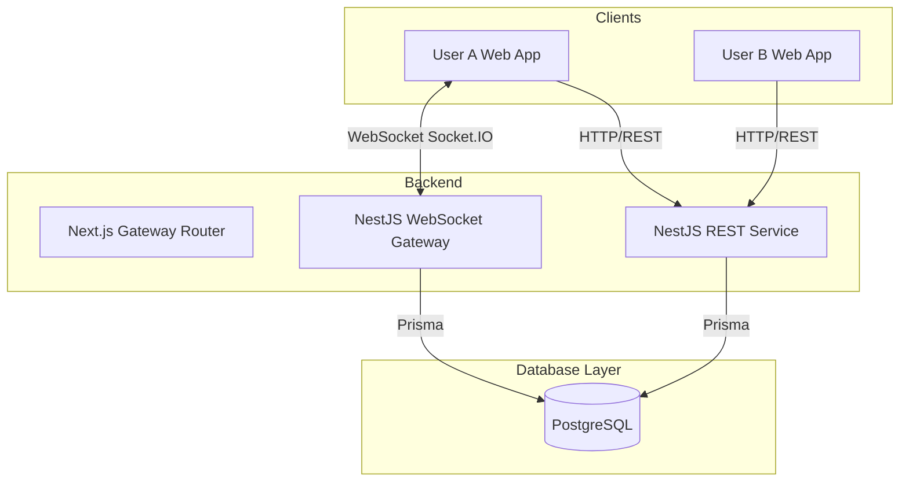
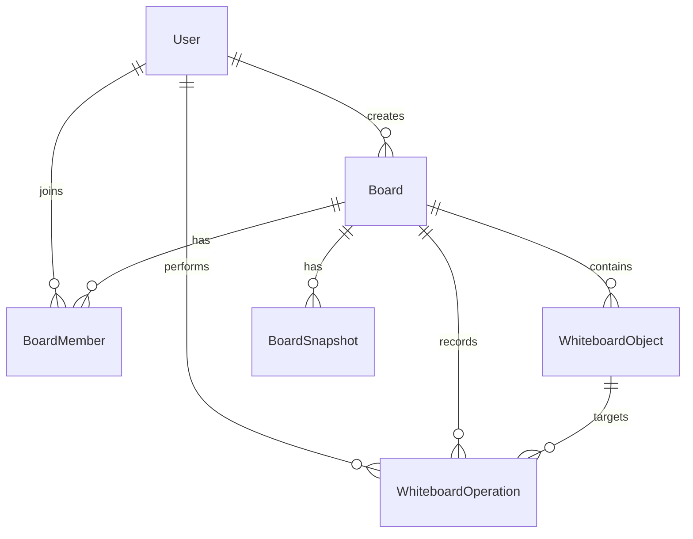

# Realtime Collaborative Tactical Whiteboard

This repository contains the **Realtime Collaborative Tactical Whiteboard** project developed for the **Viettel Digital Talent 2026 - Software Engineer Track**. It is a monorepo containing a web-based collaborative whiteboard that allows multiple users to join the same room and manipulate objects on a virtual canvas in realtime with presence awareness, conflict-aware editing, and server-authoritative persistence.

---

## 1. Project Overview & Product Goals

### 1.1 Core Values
1. **Realtime Multi-User Editing**: Shape changes made by one user are immediately visible to all other users in the room.
2. **Presence & Cursor Awareness**: Users can see who is online and track where others are pointing on the canvas in realtime.
3. **Persistence & Reconnect Recovery**: Canvas data is stored on the server, permitting full restoration of state upon reload or after disconnection.
4. **Conflict-Aware Collaboration**: The system detects stale updates using object-level versions and resolves concurrent edits via room-level revision ordering.

### 1.2 Scope & Priority (MVP vs. Non-Goals)
* **Must-Have (MVP)**: Guest sign-in (by name), public room creation and sharing via link, role enforcement (Owner, Editor, Viewer), canvas interactions (pan, zoom, create/move/resize/rotate/delete rectangles, circles, arrow lines, and text), realtime sync, remote cursors, and DB persistence.
* **Should-Have**: Google OAuth login (JWT), private rooms, owner-only room deletion, role management UI, and object-locking indicators.
* **Won't-Have**: Infinite canvas, real map integration, mobile-first design, freehand drawing, layer system, grouping, multi-select, voice/chat, or media/image upload.

---

## 2. Monorepo Architecture & Tech Stack

### 2.1 Workspace Structure
The project is structured as a Turborepo monorepo:
* **`apps/web`**: Next.js client application (React, Tailwind CSS, React-Konva, Zustand, Socket.IO Client).
* **`apps/api`**: NestJS backend application (REST APIs, Socket.IO Gateway, Prisma Client).
* **`packages/database`**: PostgreSQL database definition, Prisma schema, and migrations.
* **`packages/shared-contracts`**: Shared TypeScript types and Zod schema validations used by both frontend and backend.

### 2.2 System Architecture Diagram


---

## 3. Database Design

The database uses **PostgreSQL** with **Prisma ORM**. The schema distinguishes between the **current state** (`WhiteboardObject`) and **historical changes** (`WhiteboardOperation`) to support operations log, conflict resolution, and reconnect sync.

### 3.1 Entity Relationship Diagram


### 3.2 Prisma Schema Models
* **`User`**: Manages guest identities (`GUEST`) and Google OAuth accounts (`GOOGLE`), avatar styles, and names.
* **`Board`**: Represents the collaboration room containing metadata, the current room revision, and deletion state.
* **`BoardMember`**: Maps users to boards with roles (`OWNER`, `EDITOR`, `VIEWER`).
* **`WhiteboardObject`**: Stores current canvas objects (type: `RECTANGLE`, `CIRCLE`, `LINE`, `TEXT`), coordinate data (`x`, `y`, `width`, `height`), style properties, `zIndex`, and current `version` for conflict checks.
* **`WhiteboardOperation`**: Records sequential historical events (`OBJECT_CREATE`, `OBJECT_UPDATE`, `OBJECT_DELETE`, `OBJECT_RESTORE`) linked to specific room revisions.
* **`BoardSnapshot`**: Optional snapshots storing serialized state at fixed revisions for recovery optimization.

---

## 4. Realtime Synchronization & Concurrency Model

### 4.1 Server-Authoritative Sync Flow
Clients apply edits locally in an optimistic or preview state, but must send operations to the server for validation and final commit.
1. **Emit Operation**: The client emits a socket operation containing the changes and the target object's `baseObjectVersion`.
2. **Validate & Commit**: The server runs permission checks, verifies if `baseObjectVersion` matches the database's current object `version` (conflict check), executes a database transaction to update the object and append the operation log, increments the room's `currentRevision`, and assigns this revision to the operation.
3. **Broadcast & Apply**: The server responds back with `operation:applied` to the initiator and broadcasts it to all other room members, who then apply the mutation locally.

### 4.2 Concurrency Conflict Resolution
* **Version Check**: When a user attempts to update an object, the server checks if `client.baseObjectVersion === server.currentObjectVersion`.
* **Match**: The update is applied, object version is incremented (`version + 1`), and the room revision increments.
* **Mismatch**: The update is rejected. The server emits an error event (e.g. `operation:rejected`), and the client must rollback the optimistic edit and pull the latest state.

### 4.3 Reconnect Synchronization
When a disconnected client reconnects, it sends `sync:request` containing its last known room revision:
* If the client is only a few revisions behind, the server sends all `WhiteboardOperation` events recorded since that revision.
* If the client is too far behind or does not specify a revision, the server sends the full board state (`WhiteboardObject[]`).

---

## 5. REST API Contract

### 5.1 Authentication and Identity Resolution
The API accepts a JWT in the `Authorization` header, or falls back to Guest identity headers for the MVP:
* `Authorization: Bearer <token>`
* Guest headers:
  * `x-guest-id`: `<UUID>`
  * `x-guest-name`: `<Display Name>`
  * `x-guest-avatar-color`: `<CSS Hex Color>`

### 5.2 Key API Endpoints
* **Auth**:
  * `GET /api/v1/auth/google`: Initiates Google OAuth redirect.
  * `GET /api/v1/auth/google/callback`: Handles Google authorization code, creates/resolves user, returns JWT token.
* **Boards / Rooms**:
  * `POST /api/v1/boards`: Create a board (returns room UUID and token).
  * `GET /api/v1/boards`: List active public boards.
  * `GET /api/v1/boards/:id`: Fetch board details and active memberships.
  * `GET /api/v1/boards/:id/objects`: Load all active, non-deleted objects for the canvas.
  * `GET /api/v1/boards/:id/operations`: Fetch historical operations since a specific revision query parameter `sinceRevision`.

---

## 6. WebSocket Event Contract

All websocket events occur under the namespace namespaces and use Zod validation schemas.

### 6.1 Client to Server Events
* **`room:join`**: Joins a socket room.
  * Payload: `{ boardId: string }`
* **`room:leave`**: Leaves the current socket room.
  * Payload: `{ boardId: string }`
* **`object:create`**: Requests creation of a whiteboard object.
  * Payload: `{ clientOpId: string, object: Omit<WhiteboardObject, 'version' | 'createdAt' | 'updatedAt'> }`
* **`object:update`**: Requests an update to an object.
  * Payload: `{ clientOpId: string, objectId: string, baseObjectVersion: number, patch: Partial<WhiteboardObject> }`
* **`object:delete`**: Requests soft deletion of an object.
  * Payload: `{ clientOpId: string, objectId: string, baseObjectVersion: number }`
* **`cursor:update`**: Sends mouse coordinates for presence tracking (throttled locally).
  * Payload: `{ x: number, y: number }`
* **`selection:update`**: Sends the ID of the selected object for collaboration indicators.
  * Payload: `{ objectId: string | null }`

### 6.2 Server to Client / Room Broadcast Events
* **`room:joined`**: Sent to the client who successfully joined, returning room members.
* **`user:joined`**: Broadcasted when a new user enters the room.
* **`user:left`**: Broadcasted when a user disconnects or leaves.
* **`operation:applied`**: Broadcasted when an operation is confirmed. Includes the resolved operation payload, object ID, and the new room `revision`.
* **`operation:rejected`**: Sent to the initiator if the version or role validation failed.
* **`cursor:broadcast`**: Broadcasted to other room members containing a mapping of active user IDs to cursors.
* **`selection:broadcast`**: Broadcasted to other members containing active user selections.

---

## 7. Local Setup & Docker Compose

### 7.1 Running the Stack
Ensure ports `3000`, `3001`, and `5432` are free. Run the command below from the repository root:
```powershell
docker compose up --build -d
```
* **Web App**: `http://localhost:3000`
* **API Health Check**: `http://localhost:3001/api/v1/health`
* **PostgreSQL Database**: `localhost:5432`

### 7.2 Database Migrations in Docker
Migrations run automatically on startup via a runner service. To view migration logs:
```powershell
docker compose logs migrate
```

### 7.3 Tear Down & Volume Clean
To stop containers:
```powershell
docker compose down
```
To delete all data and reset the PostgreSQL volume completely:
```powershell
docker compose down --volumes
```
